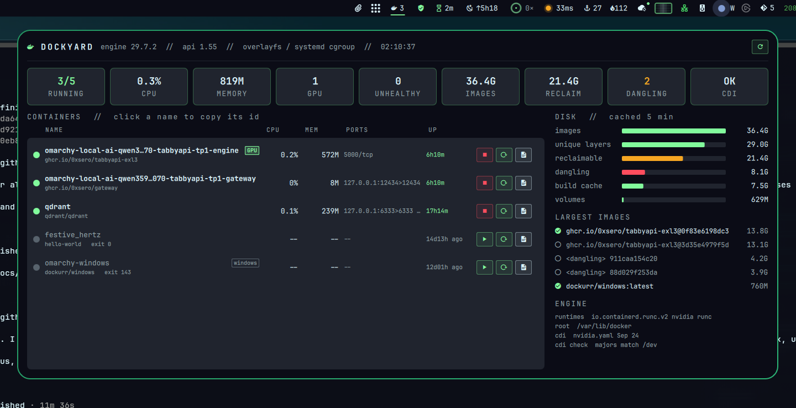
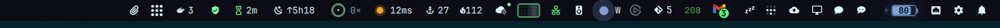
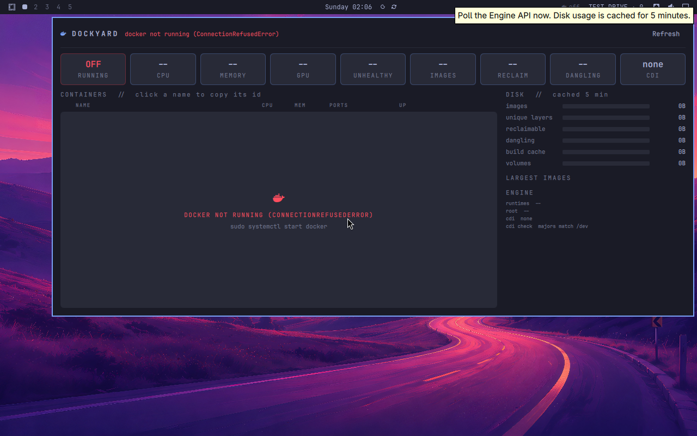
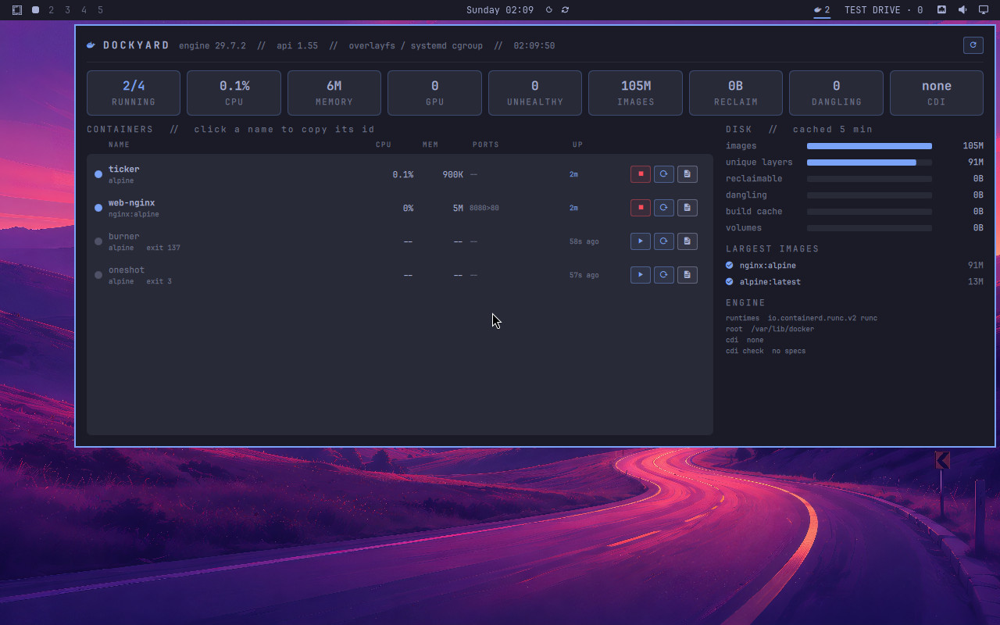

# Dockyard

A Docker containers cockpit for the Omarchy bar (`nixfred.dockyard`).

The bar shows a whale and the number of running containers. It turns red when a container is unhealthy, restarting or dead, or when the CDI spec is stale. Click it to open the panel.





## What the panel shows

Everything fits on one screen. Only the container list scrolls, and it scrolls inside its own box.

- **Stat strip:** running/total, CPU (100% = one core), memory, GPU containers, unhealthy, image size, reclaimable, dangling images, and CDI status.
- **Containers:** state dot, name, image, CPU%, memory, ports, uptime or time since exit, exit code, a GPU badge and a compose project badge. Each row has **start/stop**, **restart** and **logs** (`docker logs -f` in your terminal). Click a name to copy its id. Hover over anything for details.
- **Disk:** images, unique layers, reclaimable, dangling, build cache and volumes (from `/system/df`, cached for 5 minutes and refreshed early when the image count changes), plus the largest images.
- **Engine:** runtimes, data root, CDI specs, and a **stale CDI check**. The check compares every device major number in `/etc/cdi` and `/var/run/cdi` against the live `/dev` nodes. A mismatch means the driver has renumbered `nvidia-uvm`, and CUDA in containers will fail with "unknown error". To fix it, run `sudo nvidia-ctk cdi generate --output=/etc/cdi/nvidia.yaml`, then recreate the GPU containers.

## Docker not running

When docker is not running, the bar shows `off` and the panel says so:



Test Drive VM with sample containers:



## How it works

`dockyard.py` (Python 3, stdlib only) talks to the Engine API over `/var/run/docker.sock`. It does not need the docker CLI and does not fork per container.

- CPU% comes from each container's cgroup v2 `cpu.stat`. The previous sample is kept in `$XDG_RUNTIME_DIR`, so a poll is a few file reads and not a `docker stats` round trip. The first poll shows `--`.
- Memory is `memory.current` / `memory.max`.
- The plugin only reads, except when you click. `dockyard.py start|stop|restart <id>` checks the verb and the id before it does anything.

Your user needs to be able to read the socket (the `docker` group).

## Install

```bash
cp -r . ~/.config/omarchy/plugins/nixfred.dockyard
omarchy plugin enable nixfred.dockyard right
omarchy restart shell
```

Settings: `refreshSec` (default 10).

## License

MIT
